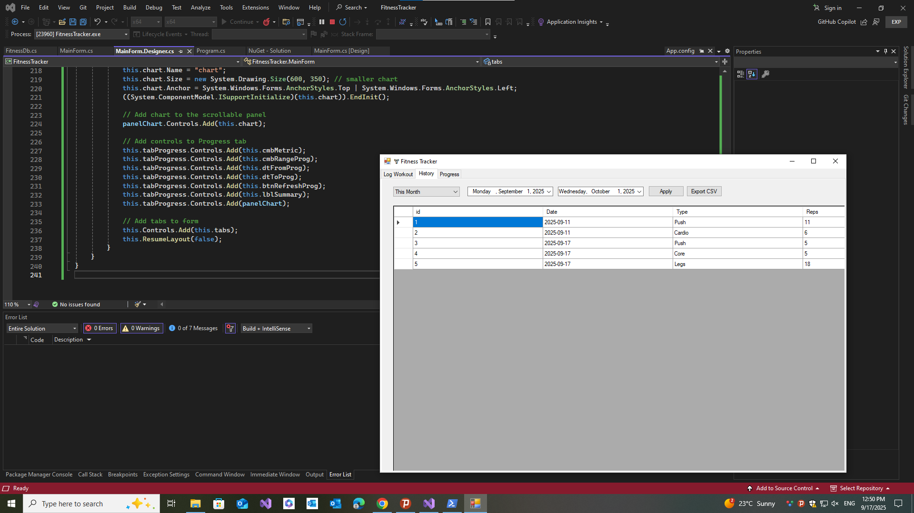
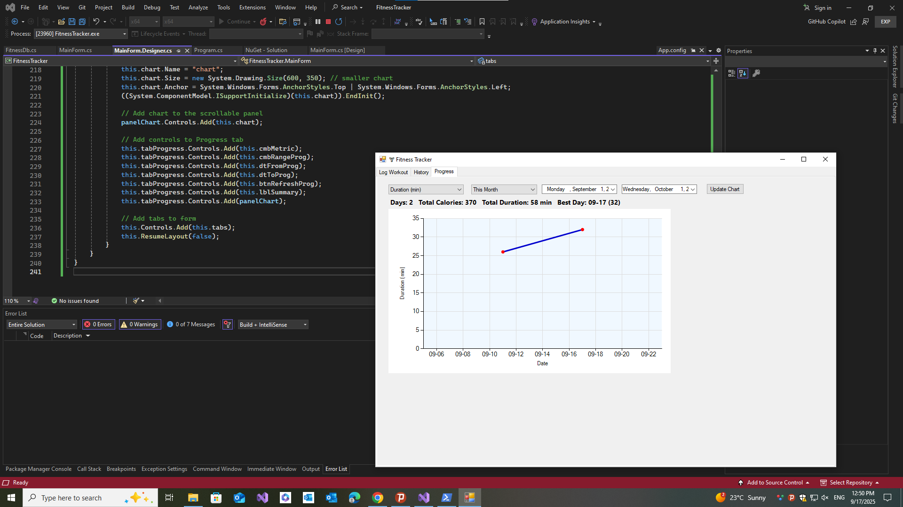

# 🏋️ Fitness Tracker

A simple **C# WinForms desktop application** to log workouts, review history, and visualize progress with charts.  
Built with **.NET Framework 4.7.2**, **WinForms**, and **SQLite**.

---

## ✨ Features

- **Log Workouts**  
  Record date, workout type, reps, duration, and calories.

- **Workout History**  
  - Filter by date range (All, This Week, This Month, Custom)  
  - View workouts in a table  
  - Export history to CSV

- **Progress Tracking**  
  - Line chart showing calories or duration over time  
  - Scrollable chart area (fixed 600×350 chart with scrollbars)  
  - Summary stats: total workouts, total calories, total duration, best day

- **Local Storage**  
  Uses a local SQLite database stored in the user's AppData folder.

---

## 🛠️ Technologies Used

- **C# WinForms** (.NET Framework 4.7.2)
- **SQLite** via [Microsoft.Data.Sqlite](https://www.nuget.org/packages/Microsoft.Data.Sqlite)
- **System.Windows.Forms.DataVisualization** (for charts)

---

## 📂 Project Structure

FitnessTracker/

├── Program.cs # Application entry point

├── MainForm.cs # Main UI logic

├── MainForm.Designer.cs # WinForms Designer code

├── FitnessDb.cs # Database helper (SQLite)

├── Properties/ # Project settings

└── README.md # Project documentation

---

## 📊 Usage

1. Go to Log Workout tab → enter workout details → click Save Workout.

2. Check the History tab → filter workouts and export CSV.

3. Open the Progress tab → view chart and summary stats.

- Chart is fixed at 600×350 and scrollable.

- Select Calories or Duration metric.

---

## 📷 Screenshots

### Log Workouts	

### History	

### Progress Chart

